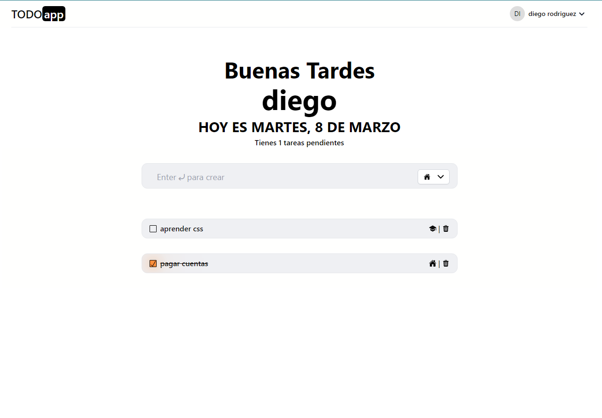

# TODO app

TODO app , aplicación para organizar tus tareas e ideas hecho con react, requiere registro y logeo de usuario.
<br />
Para probar puedes usar `email:test@gmail.com, password:123456`
  

- Parte Backend [todo-app](https://github.com/DiegoRodriguez-sc/todo_app-backend)

### Built With 🛠️


* [React.js](https://es.reactjs.org/)
* [Tailwindcss](https://tailwindcss.com/)
* [Framer motion](https://www.framer.com/motion/)

## Live demo 🔴

Sitio Web - [TODO app](https://vercel.com/diegorodriguez-sc/todo-app-dr).





## Getting Started 🚀

Para obtener una copia local en funcionamiento, siga estos sencillos pasos de ejemplo.

### Installation

1. Clone the repo
   ```sh
   git clone https://github.com/DiegoRodriguez-sc/todo_app-frontend.git
   ```
2. Install NPM packages
   ```sh
   npm install
   ```


## Contact ☎️

 * [Linkedin](www.linkedin.com/in/diego-rodriguez-sc)

* Project Link: [https://github.com/DiegoRodriguez-sc/todo_app-frontend](https://github.com/DiegoRodriguez-sc/todo_app-frontend)